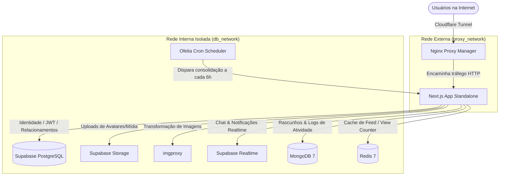

<div align="center">
  

  # 📚 LiteraConnect

  [](https://nextjs.org/)
  [](https://www.docker.com/)
  [](https://tailwindcss.com/)
  [](https://www.typescript.org/)
  [](LICENSE)

  **Uma plataforma social moderna para leitores e autores, inspirada no Substack, focada em performance extrema e arquitetura 100% self-hosted.**

  [Arquitetura e Stack](file:///c:/PROJETOS/LiteraConnect/docs/01_Arquitetura_e_Stack.md) • [Modelagem de Dados](file:///c:/PROJETOS/LiteraConnect/docs/02_Bancos_de_Dados.md) • [Manual de APIs](file:///c:/PROJETOS/LiteraConnect/docs/03_Backend_e_APIs.md) • [Roadmap](file:///c:/PROJETOS/LiteraConnect/docs/04_Roadmap_e_Sprints.md) • [Deploy & CI/CD](file:///c:/PROJETOS/LiteraConnect/docs/05_Deploy_e_CI_CD.md)
</div>

---

## 🚀 Sobre o LiteraConnect

O **LiteraConnect** é um ecossistema social completo que une a criação de conteúdo rico, publicação estruturada, chat em tempo real e grafos sociais em uma experiência contínua e fluida.

Anteriormente dependente de infraestruturas em nuvem proprietárias (BaaS), o LiteraConnect foi completamente refatorado para ser **100% autossuficiente (Self-Hosted)**. Ele roda em um servidor dedicado sob Docker, utilizando o princípio de **Polyglot Persistence** para distribuir cargas de trabalho de forma inteligente e eficiente, garantindo suporte para mais de **500 usuários simultâneos** e processamento fluido de mídias pesadas.

---

## 🏗️ Arquitetura do Sistema & Rede

A infraestrutura foi desenhada para isolar os dados confidenciais e expor na internet somente o necessário, utilizando redes virtuais internas no Docker:

*   **`proxy_network`**: Rede externa onde o tráfego de entrada oriundo do **Nginx Proxy Manager** (através de um **Cloudflare Tunnel**) chega até o container do Next.js.
*   **`db_network`**: Rede interna 100% isolada e sem rota para a internet, onde residem os bancos de dados PostgreSQL, Redis, MongoDB e demais serviços de apoio do Supabase.



---

## ⚡ A Trindade de Dados (Polyglot Persistence)

Para alcançar performance de nível de produção com custo zero de licenças SaaS:

1.  **Supabase PostgreSQL (Cérebro):** Fonte da verdade para autenticação (via GoTrue), relacionamentos de grafos sociais (`follows`), transações seguras de likes/comentários e orquestração do WebSockets Realtime.
2.  **MongoDB (Memória):** Otimizado para persistir os documentos JSON complexos do editor WYSIWYG (TipTap) na forma de rascunhos (`drafts`) e posts publicados. Também lida com logs imutáveis de alta volumetria (`activity_logs`).
3.  **Redis (Sistema Nervoso):** Cache de timeline dinâmico com TTL curto e contadores atômicos de visualizações (`post:{id}:views`) de altíssima frequência via comando `INCR` (custando apenas ~8 bytes por post em comparação aos ~12KB de estruturas HyperLogLog).

---

## 🛠️ Configuração e Instalação

### Pré-requisitos
*   **Docker Engine** v25+ e **Docker Compose** v2+
*   **Node.js** v20+ (para desenvolvimento local)
*   **Nginx Proxy Manager** (ou similar configurado na `proxy_network`)

### 1. Clonar o repositório
```bash
git clone https://github.com/joaopssouza/LiteraConnect.git
cd LiteraConnect
```

### 2. Configurar as Variáveis de Ambiente
Copie os modelos de arquivos de ambiente e preencha com suas configurações de domínio e chaves seguras:
```bash
cp .env.example .env
```
> ⚠️ **IMPORTANTE:** Nunca comite arquivos `.env`, `.env.server` ou `.env.mcp.local` para o controle de versão do Git. Eles contêm segredos criptográficos confidenciais.

### 3. Subir a Infraestrutura Completa (Docker)
Antes de rodar, garanta que a rede `proxy_network` já existe no seu Docker host:
```bash
docker network create proxy_network
```
Em seguida, inicialize todos os containers em background:
```bash
docker compose up -d
```
O Docker irá inicializar e configurar automaticamente:
*   Banco de dados PostgreSQL com o esquema de tabelas (`database.sql`) pré-carregado.
*   GoTrue Auth, PostgREST API, Supabase Storage, Realtime e Studio admin.
*   Redis e MongoDB devidamente isolados.
*   Ofelia Scheduler para acionar a cron de sincronização do banco a cada 6 horas.
*   A aplicação Next.js rodando em modo produção `standalone`.

---

## 💻 Desenvolvimento Local (Sem Docker para o Next.js)

Se você deseja desenvolver no Next.js localmente, com Fast Refresh, enquanto consome os bancos de dados rodando no Docker:

1.  Garanta que a infraestrutura no Docker está de pé (`docker compose up -d`).
2.  Exponha temporariamente as portas dos bancos no seu `docker-compose.yml` (se aplicável) ou configure seu arquivo `.env` local apontando para `localhost` e as portas mapeadas correspondentes.
3.  Instale as dependências locais:
    ```bash
    npm install
    ```
4.  Inicie o servidor de desenvolvimento utilizando o **Turbopack** para compilação instantânea:
    ```bash
    npm run dev
    ```
5.  Acesse seu projeto local em: `http://localhost:3000`

---

## 🗃️ Estrutura do Repositório

```text
├── .vscode/               # Configurações do VS Code (incluindo MCP Supabase)
├── app/                   # Next.js App Router (Páginas e API Routes)
│   └── api/               # API do Backend (Activity, Chat, Drafts, Cron)
├── components/            # Componentes React de UI (Navigation, Editor, etc.)
├── contexts/              # Contextos React (Auth, Realtime)
├── docs/                  # DOCUMENTAÇÃO OFICIAL DO PROJETO (Obsidian-friendly)
│   ├── 00_LiteraConnect_Home.md
│   ├── 01_Arquitetura_e_Stack.md
│   ├── 02_Bancos_de_Dados.md
│   ├── 03_Backend_e_APIs.md
│   └── 04_Roadmap_e_Sprints.md
├── hooks/                 # React Hooks customizados
├── lib/                   # Inicializadores e SDKs (Supabase client, MongoDB, Redis)
├── public/                # Assets estáticos públicos da aplicação
├── supabase/              # Configurações e scripts locais do Supabase (Kong, SQL)
├── Dockerfile             # Dockerfile otimizado para build standalone multinível
├── docker-compose.yml     # Orquestrador da stack self-hosted completa
└── database.sql           # Script de migração estrutural inicial do banco
```

---

## 🛡️ Sincronização e Cron Jobs (Ofelia)

Para evitar que o banco de dados PostgreSQL sofra de concorrência com escrita contínua de visualizações em posts de alta circulação, implementamos o **Ofelia Scheduler** no Docker.

*   O Redis rastreia as views de posts usando a chave rápida `post:{id}:views`.
*   A cada 6 horas (`@every 6h`), o Ofelia envia uma requisição `POST` autenticada interna para `/api/cron/consolidate-views` contendo o cabeçalho `Authorization: Bearer <CRON_SECRET>`.
*   A API lê todas as chaves do Redis via pipeline (`redis.multi()`), atualiza em lote os dados do Supabase e salva os logs estruturados no MongoDB (`cron_logs`).

---

## 📞 Suporte e Contato

*   **Organização:** joaopssouza/LiteraConnect
*   **Documentação Interna:** Explore a pasta `/docs` utilizando qualquer editor Markdown ou o **Obsidian** para obter gráficos de relacionamento de páginas e visualizações de grafo de notas.

---
<div align="center">
  <sub>Desenvolvido com 💙 por joaopssouza e mantido pela comunidade LiteraConnect.</sub>
</div>
