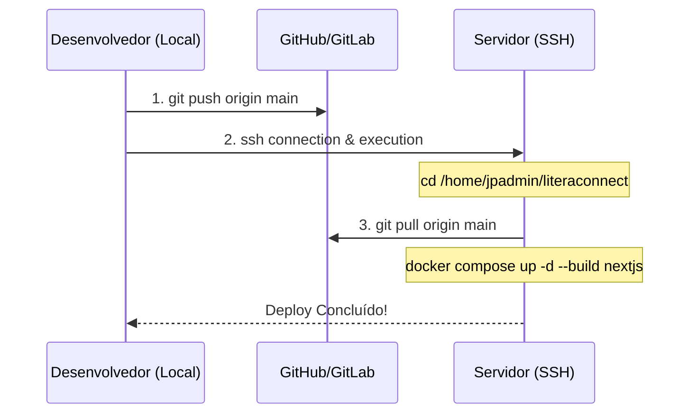

# 🚀 Fluxo de Deploy & CI/CD via Git e SSH

Este documento descreve o processo e as configurações para subir as atualizações do código do **LiteraConnect** do repositório local diretamente para o servidor de produção utilizando o fluxo baseado em Git + SSH.

---

## 🏗️ Fluxo de Trabalho (Método Ideal)

O deploy é realizado em duas etapas integradas:
1. **Local (Push):** Commitar as alterações na branch `main` e enviá-las para o servidor remoto do GitHub/GitLab.
2. **Servidor (Pull & Rebuild):** Conectar via SSH ao servidor de produção, rodar `git pull` e forçar o rebuild do container Docker do Next.js.



---

## 🛠️ Configuração Inicial no Servidor (Executar apenas uma vez)

Se o repositório no servidor `/home/jpadmin/literaconnect` ainda não estiver rastreando o Git, siga os passos abaixo para sincronizá-lo:

1. Acesse o servidor via SSH:
   ```bash
   ssh jpadmin@ssh.jpdev.uk
   ```
2. Navegue até o diretório do projeto:
   ```bash
   cd /home/jpadmin/literaconnect
   ```
3. Inicialize o Git e aponte para o repositório remoto:
   ```bash
   git init
   git remote add origin https://github.com/joaopssouza/LiteraConnect.git
   ```
4. Baixe as informações do repositório remoto sem sobrescrever arquivos não rastreados (como arquivos `.env` locais do servidor):
   ```bash
   git fetch
   git checkout -f main
   ```

---

## 🔄 Executando o Deploy

### 1. Manualmente

**Passo 1 (Local):**
```powershell
git add .
git commit -m "feat: suas atualizações"
git push origin main
```

**Passo 2 (SSH / Produção):**
```powershell
ssh jpadmin@ssh.jpdev.uk "cd /home/jpadmin/literaconnect && git pull origin main && docker compose up -d --build nextjs"
```

### 2. Automaticamente (Via Script de Deploy)

Para agilizar o processo, criamos o script automatizado [deploy.ps1](file:///c:/PROJETOS/LiteraConnect/deploy.ps1) na raiz do projeto. Ele cuida de todo o processo acima com apenas um comando.

Para usá-lo, execute no PowerShell local:
```powershell
.\deploy.ps1
```

---

## 🛡️ Segurança e Boas Práticas

* **Exclusões no Git:** O arquivo [.gitignore](file:///c:/PROJETOS/LiteraConnect/.gitignore) está configurado para garantir que arquivos de ambiente sensíveis (como `.env`, `.env.local`) **nunca** sejam enviados ao repositório git público.
* **Segredos no Servidor:** As variáveis de produção permanecem seguras dentro do servidor no arquivo `.env` local.
* **Controle de Acesso:** A comunicação SSH utiliza chaves de autenticação seguras criptografadas.
